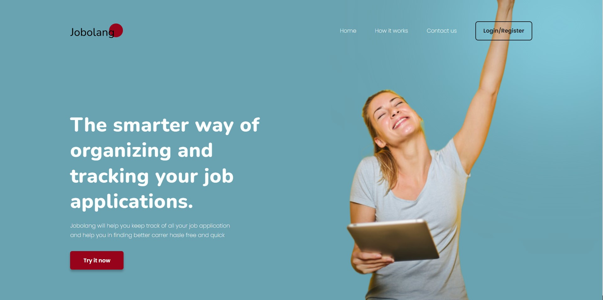
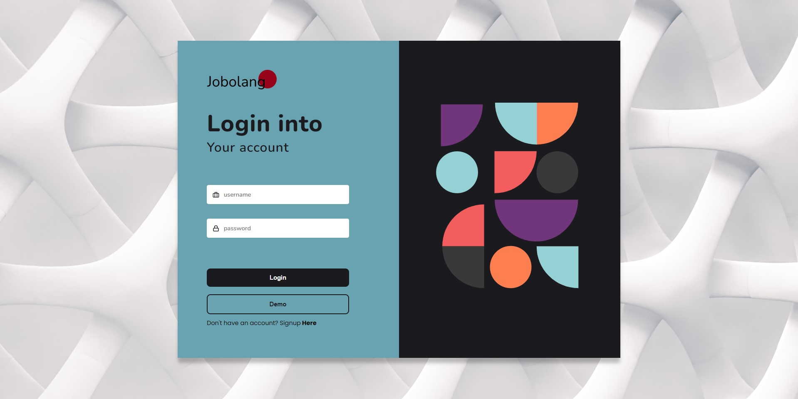
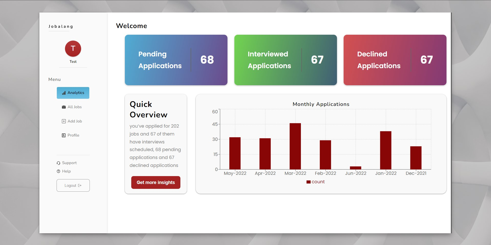
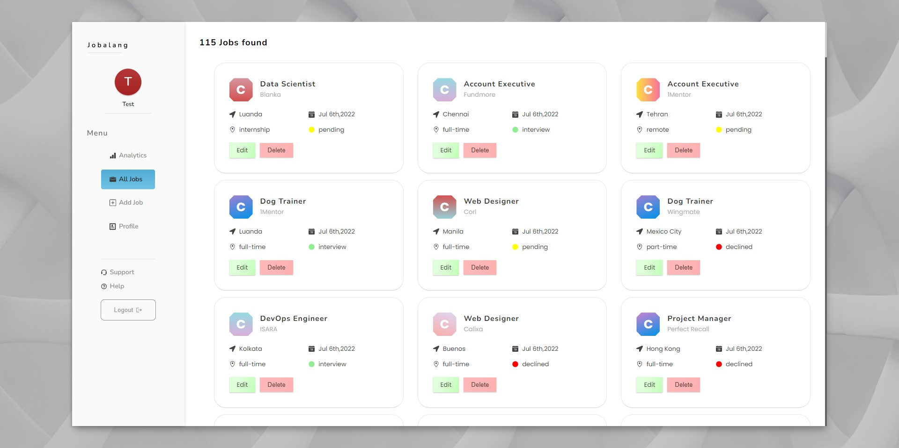
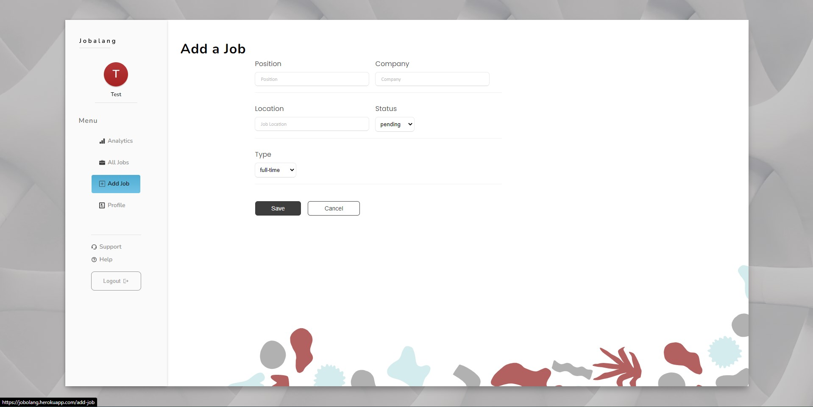
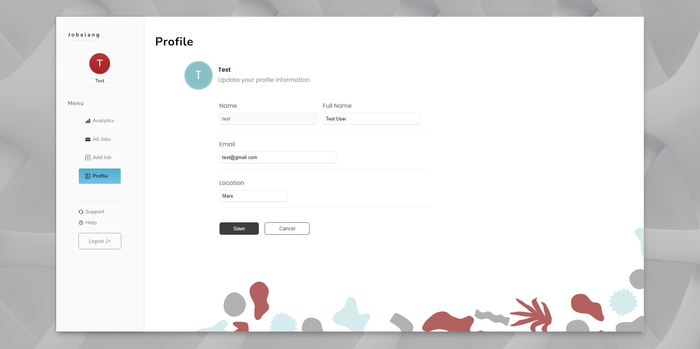

<h1>Jobolang </h1>
  

A full stack app built with spring boot and react for managing our ever growing job applications. 

  
 

Tech stack -–> React, React Hooks, Redux Toolkit, Axios, Styled Components, Recharts, Spring Boot, Spring Data JPA, Lombok, Spring Security, MongoDB

 

Check out live demo!

 Note: The app is hosted on heruko, initial page loading might take about 30 seconds for heruko front-end app to start up from sleep and first request to backend server might take 30 seconds for backend-server to start up from sleep, thank you for your patience.

<a href="https://jobolang.herokuapp.com/" target=”_blank”> <s> View Demo </s></a>

Note: Unfortunately heroku no longer has free tier plan, so the demo link won't work. I'm working to move it to a free alternative

I'm working on improving the app and adding additional functionalities. I'll soon be adding a detailed readme. 

 

I spent considerable time on designing the user interface as well, so please check out the below behance link and leave a appreciation if you liked it and provide any suggestions for improvement

<a href="https://www.behance.net/gallery/143349711/Jobolang-Application-Landing-Page" target=”_blank”>View UI Design</a>
 
  
 <h1>
 Screenshots of the website
 </h1>
 
 
 
 
 
 
